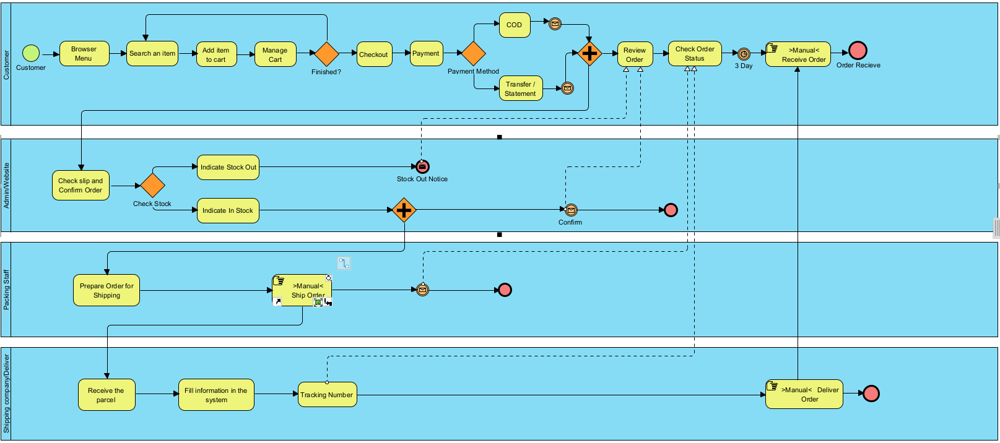
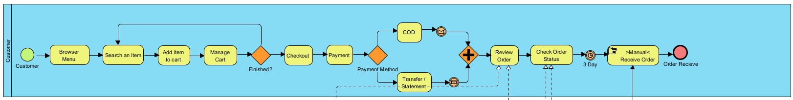
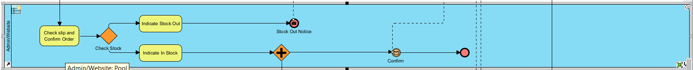
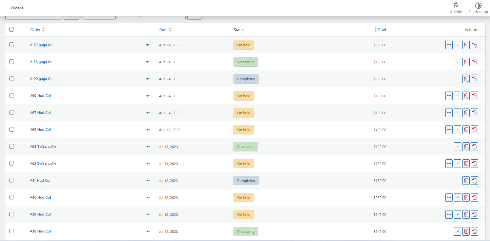
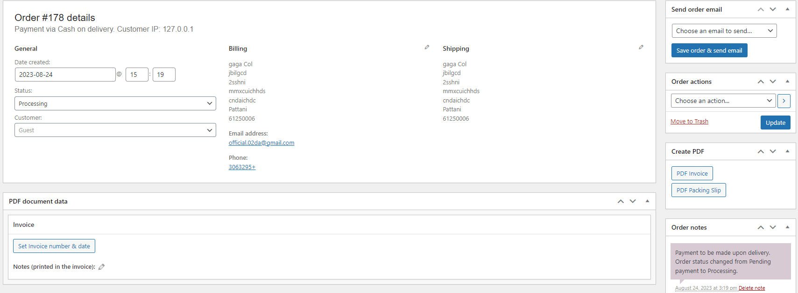
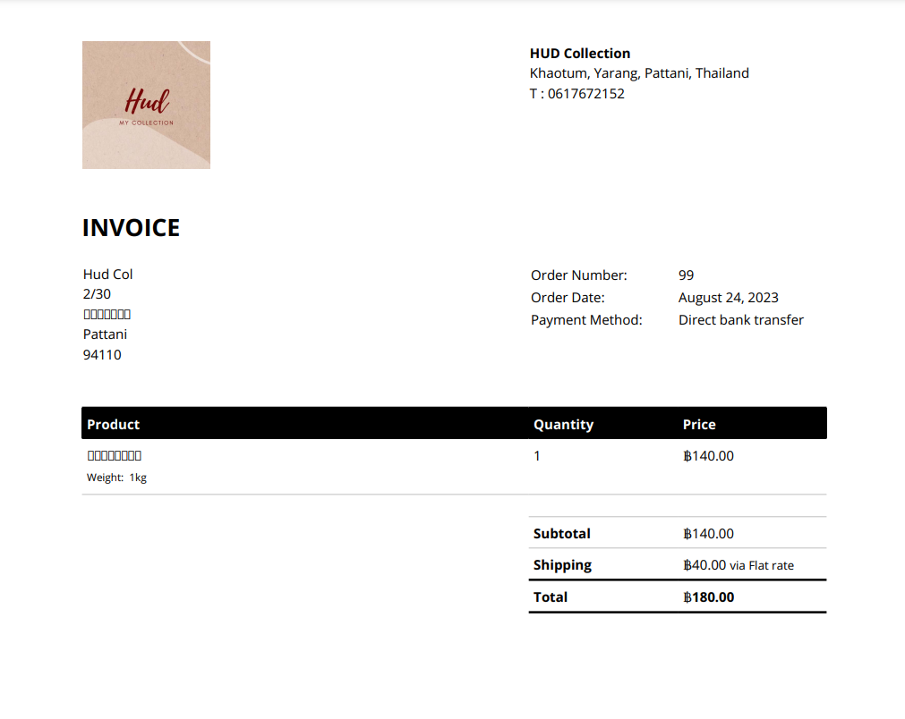
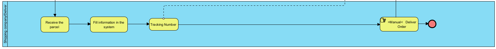

# HUD Collection By using Wordpress
Design and Develop Modern Ecommerce Platform

### Abstract 
My project involves taking a HUD Collection of pages on various platforms and turning them into a website in order to create a more efficient online store. This ecommerce extension is built on the popular WordPress content management system. It offers a powerful feature set tailored to the needs of online retailers with product support Payment channels and a variety of delivery options. It provides customers with a smooth and user-friendly shopping experience, The platform's flexibility allows businesses to create unique and branded online stores And an extensive plug-in ecosystem helps expand its capabilities. Whether you are a small boutique or a large enterprise, The WordPress ecommerce platform helps you manage your online business efficiently and drive sales.
### I.INTRODUCTION
WordPress is a computer program (Software) that helps you create and manage websites or blogs on the Internet easily and efficiently. It is commonly used to create websites and blogs, and there are many plugins and themes that can be added to customize a website according to the user's needs.

We therefore want to develop our online business to be more efficient and increase sales than ever before. Using WordPress and WooCommerce to help manage the eCommerce system more easily. and is attractive to customers who come to shop on our website In the following section We will provide information that will be used with the goal of making our website and systems easier to use for business owners and customers.
#### Software and Tools Used
**1.WordPress** serves as the main content management system (CMS) for our website. It offers a flexible and easy-to-use environment for managing web content.

**2.WooCommerce** it is a free WordPress website plugin that will help turn your website into a professional ecommerce store. it is an additional plugin in WordPress that makes creating and managing an online store easy. And it also has many useful features.

**3.Laragon** is an emulator that allows our machine to function as a Web Server, ideal for creating and managing modern web applications. Focus on efficiency Designed with stability in mind Simplicity, flexibility and freedom.

**4.Theme** a set of files that define the look and functionality of your website. Control the design, layout, and style of your website. With a variety of customizable themes You can easily change the look of your site.

**5.PDF Invoices & Packing Slips for WooCommerce** helps you create custom sales documents. It also allows you to add brand identity to your buyers' paper/paperless projects.

### II.LITERATURE REVIEW
For an introduction to the topic of WordPress and its importance in the world of web development and content management, read the Abstract or Introduction section above.
#### BPMN Diagram

    

The first step is to design the entire functional framework of the website and how it works, both internal and external systems By using BPMN to mainly have customers, system administrators, Employees for packing/delivery and deliver.

**Customer**

Activities of customers on our website.

    

- Starts with the customer opening our website it will show **Browser Menu Page**.
- **Search an item** Customers can search for the products they want on our website.

 //Wordpress
     

- **Add Item to Cart** Finished adding desired products to cart, Customer can also reduce or add products as desired and this will lead to the next step.

 //Wordpress
     

- **Manage Cart** will display the details of the product list, The number of orders, the price, and the total amount automatically.

 //Wordpress
     

- **Check Out** Customers fill in shipping details along with Payment.
- **Payment** You can choose from 2 payment channels: 
* Transfer
* COD (Cash On Deliver)

 //Wordpress
     

- **Review Order** Customers can check the status of their orders whether they are successful or not through this page.

 //Wordpress
     

- **Check Order Status** once the product has been dispatched, customers can check the status of their order.
- **Received Order** the transport has successfully delivered the product.

**Admin**

 
     

- **Check Slip and Confirm Order.**

-If Stock Out, If the product is out of stock, the admin will send another email to the customer to let them know that it is out of stock Or interested in other products instead?.

-If In Stock, Admin will accept the order and send information to the packing staff again to prepare for delivery.

 
     
     

**Packing Staff**

 
     

- **Prepare Order For Shipping** Pack the product properly before sending.
- **Ship Order to Deliver** once shipped the packing staff will update the package status to the customer so that tracking of the parcel is easy with Deliver.

 
     

**Shipping Company/Deliver**

 
     

- **Received the parcel** Receive parcel from sender.
- **Fill information in the system** Enter sender and recipient information into the system to issue parcel numbers and update status to recipients periodically.
- **Deliver Oreder to Customer**

### III.METHODOLOGY
In studying and developing the Hud Collection, we will use Agile to make the software better by making development agile, it has to be done continuously without stopping, even if something affects you it doesn't matter, When there is a change We can support that change quickly and not in a fixed way.

Agile is conceptual framework and methods for working quickly and fluently To adjust to be able to respond quickly to customers in uncertain conditions.Agile model We will choose some principles to do, it is one way to apply the principles of Agile to deal with existing documents and systems.

**Develop** Will work with customers and work together to develop specifications and features. which can be tested and given feedback.
* Develop a WordPress theme or customize an e-commerce theme to meet the design and functionality requirements.
* Utilize WordPress plugins or custom development for e-commerce features like product catalogs, shopping carts, and payment processing.
* Employ responsive design principles to ensure the website is mobile-friendly.

**Test** Continuously test and improve results according to the tester's recommendations.
Testing should be an essential part of any Agile process.
* Implement automated testing wherever possible to ensure code quality.
* Perform manual testing to validate the functionality and user experience.
* Use staging environments to thoroughly test the website before deploying changes to the production site.

**Deploy** Laragon is a popular local development environment for PHP and MySQL applications. Deploying a web application developed with Laragon.

* Development with Laragon: Develop your web application locally using Laragon's integrated web server and database server (usually Apache, PHP, and MySQL).
Ensure your application is working correctly on your local machine.

* Choose a Hosting Solution: Select a hosting provider or platform to deploy your web application. This could be a shared hosting service, cloud hosting (e.g., AWS, Azure, Google Cloud), or a specialized platform (e.g., Heroku, Netlify).
### IV.EXPERIMENTATION AND RESULT
Experimentation and testing are critical aspects of optimizing an e-commerce website built on WordPress. They allow you to make data-driven decisions to improve user experience, increase conversions, and boost sales.

* The goal is to expand the online store widely. Access is easier and more systematic. When doing the study, it was found that Using wordpress In developing ecommerce, it is very responsive because there are many functions and plug-ins that can be applied. To develop our website better according to the situation.
* Use an A/B testing tool or plugin designed specifically for WordPress, such as Google or Edge. When running, it was found that the system had no problems at all. Not stuck or stuck It can be said that it is convenient to use.
* Personally, I think woocommerce There's still a lot to try out. If we develop it further It may create more income and sales. and save a lot of expenses whether it is about Hire more employees to take care of the system or admin. If we can do this, it will reduce costs and time even more.

### V.CONCLUSION
Ecommerce on WordPress is valuable and starting an online business or expanding one will offer you the guidance and continuity of an accessible online store and reach customers across the globe through. Internet simultaneously made easier
### REFERENCES
-https://chat.openai.com/c/2eccc2b3-fdb0-4328-87ee-de8ad72950bb.

-https://www.iplandigital.co.th/.

-https://woocommerce-pdf-invoices-packing-slips.softonic-th.com/wordpress.

-https://www.hostinger.com/tutorials/.

-https://reg7.pwa.co.th/kmr7/?p=453#:~:text=Agile%20%

-https://www.amco.in.th/newsroom/agile-methodology/
