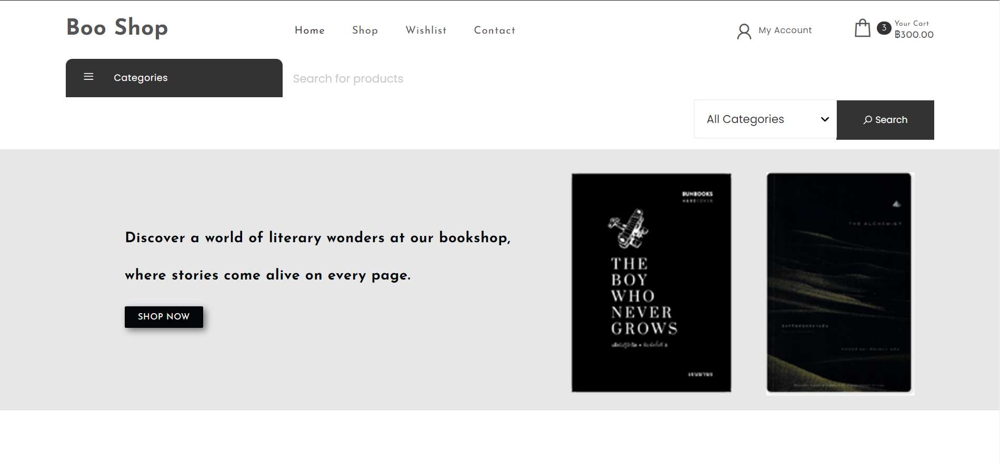
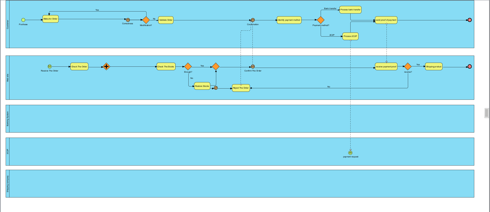

# Modern-Ecommerce-Platforms
Design and Develop Modern Ecommerce Plafform

## Project Overview
The project is about developing an E-Commerce Website for Boo Shop, a book store. The website will be built using the **WordPress** content management system (CMS) and will integrate the WooCommerce plugin to facilitate seamless e-commerce functionality. This platform will allow Boo Shop customers to browse, select, and purchase books online, enhancing their shopping experience and providing a convenient way to access the store's offerings.

## Plugin
- WooCommerce
- Elementor
- PDF Invoices & Packing Slips for WooCommerce
- 2C2P Redirect API for WooCommerce
- Opn Payments
  
## Theme
Own Shope version: 1.2   
By Spiracle Themes

## BPMN Diagram

This BPMN diagram show my E-Commerce Website processes, showcasing key interactions and workflows that enhance the platform's user-friendly online bookstore experience.

## Conclusion
............

## Author
Bukhoree Sohprajin - 631431003
