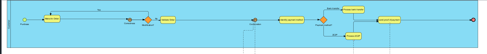
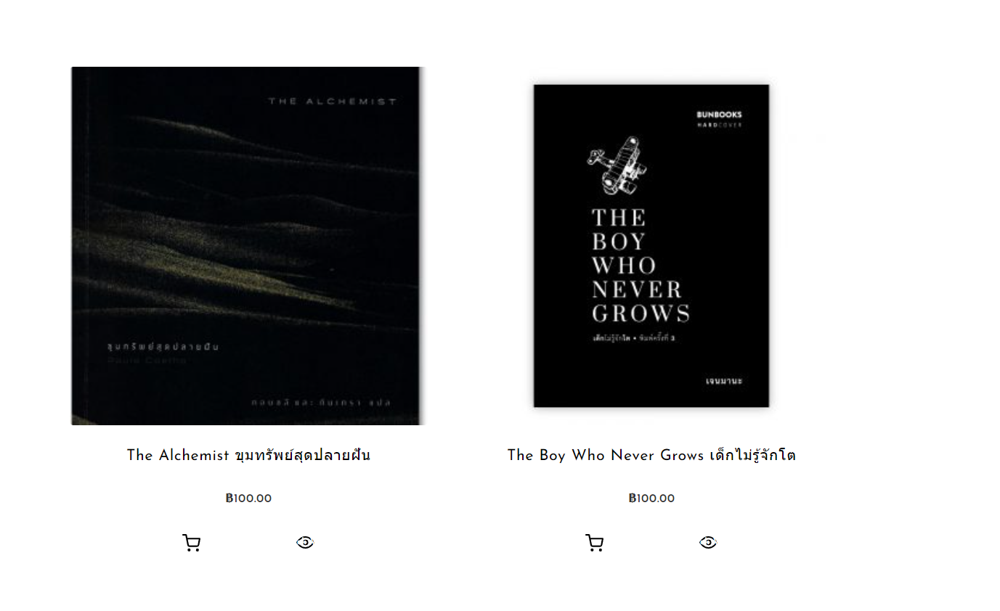
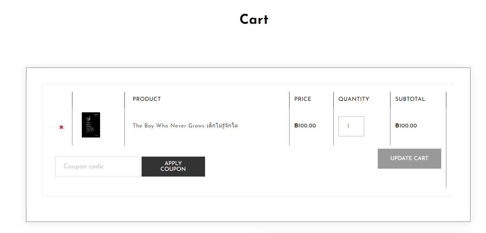
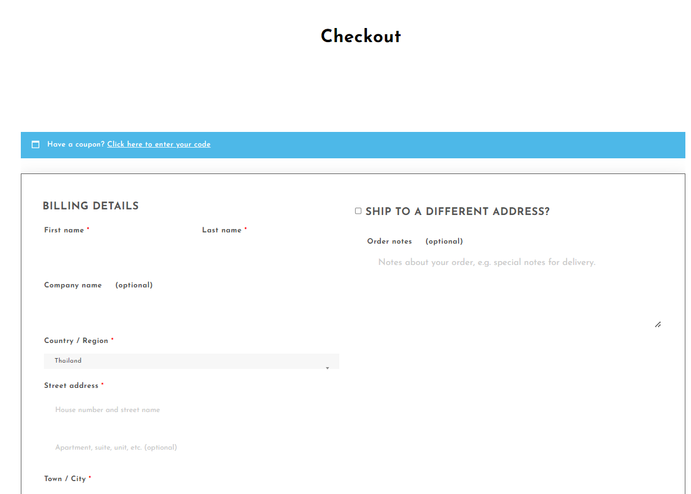
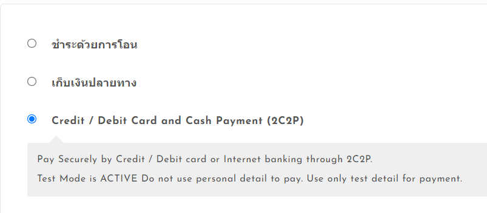
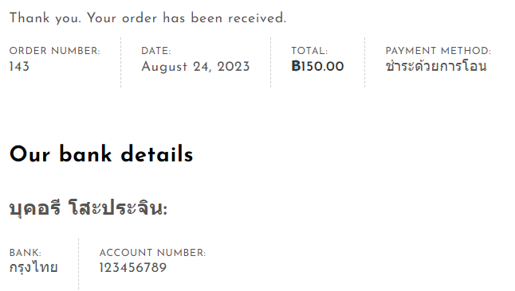

# Modern-Ecommerce-Platforms
Design and Develop Modern Ecommerce Plafform

## Project Overview
The project is about developing an E-Commerce Website for Boo Shop, a book store. The website will be built using the **WordPress** content management system (CMS) and will integrate the WooCommerce plugin to facilitate seamless e-commerce functionality. This platform will allow Boo Shop customers to browse, select, and purchase books online, enhancing their shopping experience and providing a convenient way to access the store's offerings.

## Plugin
- WooCommerce
- Elementor
- PDF Invoices & Packing Slips for WooCommerce
- 2C2P Redirect API for WooCommerce
- Opn Payments
  
## Theme
Own Shope version: 1.2   
By Spiracle Themes

## BPMN Diagram

This BPMN diagram show my E-Commerce Website processes, showcasing key interactions and workflows that enhance the platform's user-friendly online bookstore experience.

## All Pools in BPMN
- Customer
- Website
- Banking system
- 2C2P
- Shipping company

### Customer pool

- **Customer Pool:** Represents the group of customers interacting with the platform.

- **Start Event (Green Circle):** Marks the beginning of the customer's journey on the platform.

- **Make an Order Process:** Encompasses the steps related to creating an order.

  - **Select Products:** The customer selects the desired products from the available options.

      

  
  - **Add to Cart:** The selected products are added to the customer's shopping cart.

      

- **Check Out Process:** The process to Checkout the product. 

  - **Fill the shipping detail:** The customer fill their shipping detail.

      
  
  - **Identify payment method:** Payment information, such as credit card details, is entered.

      
  
  - **Make a payment:** In my website have 2 paymant method are banking tranfer and 2C2P.

      

- **Send payment proof:** If the customer choose banking tranfer, they have to sent the photo of payment. but If the customer use 2C2P, they no need to sent the proof.
- **Order Completed:** The final step indicating that the order has been successfully placed.

### 

## Conclusion
testt trsrsrs f sdfsdf sdf s ds

## Author
Bukhoree Sohprajin - 631431003
