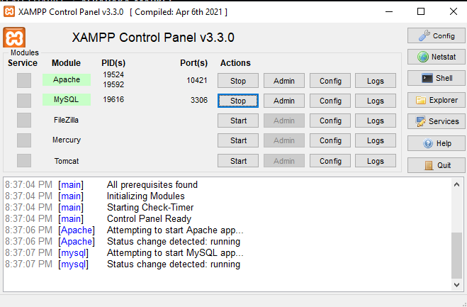
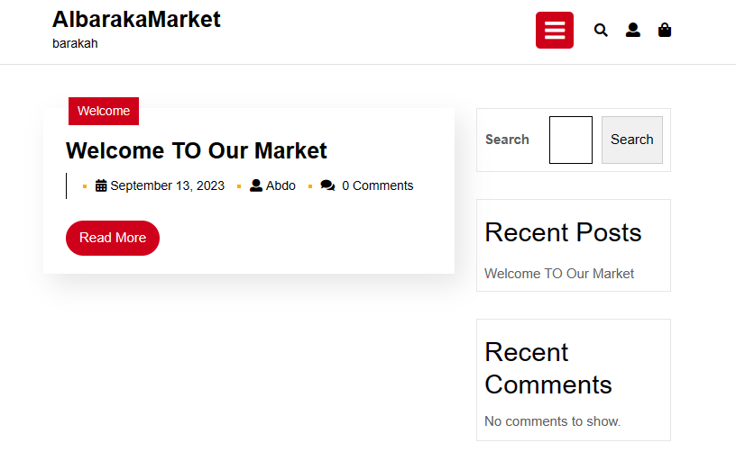
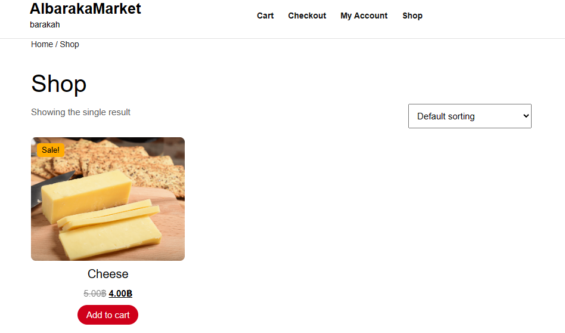
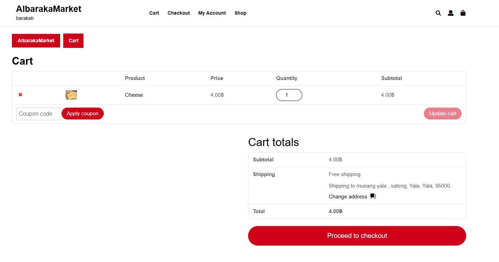
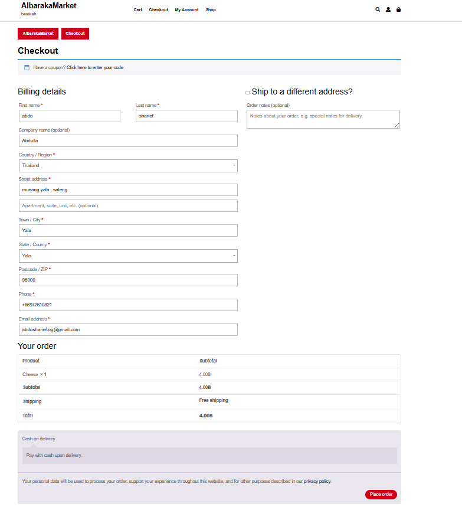
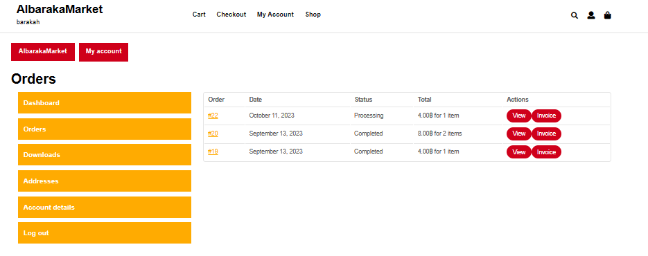

# Modern-Ecommerce-Platforms
Design and Develop Modern Ecommerce Plafform

## Project Overview
The project is about developing an E-Commerce Website for AlbarakaMarket , Food market. The website is built using the **WordPress** content management system (CMS) and will integrate the WooCommerce plugin to facilitate seamless e-commerce functionality. This platform will allow AlbarakaMarket customers to browse, select, and purchase Food prodcuts online, enhancing their shopping experience and providing a convenient way to access the store's offerings.

## DATABASE Platform
- Xamp v3.3.0
- PHP MY Admin

## Plugins 
- WooCommerce  # An eCommerce toolkit that helps you sell anything. 

- Akismet Anti-spam: Spam Protection  # Akismet is quite possibly the best way in the world to protect your blog from spam.

- PDF Invoices & Packing Slips for WooCommerce   # Create, print & email PDF invoices & packing slips for WooCommerce orders.

## Theme
**Online Food DeliveryVersion: 0.2.8**  
**By ThemesCaliber**

## LOGIN

## Home PAGE

## USER INFO

## SHOP LIST

## CHOOSE PRODCUT

## CART

## CHECK OUT

## PILLING OPTIONS

## ORDER PILL

## ORDER TRACK

## INVOICES

## Author
**ABDULLAH-ALSHARIEF 601431019**
